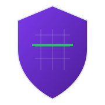

<p align="center">
  
</p>

<h1 align="center">Web Security Scanner</h1>

<p align="center">
  <strong>Passive security analysis for web applications — 240+ checks, zero site modification, privacy-first.</strong>
</p>

<p align="center">
  <a href="LICENSE"></a>
  <a href="CONTENT-LICENSE.md"></a>
  <a href="https://www.python.org/"></a>
  <a href="https://fastapi.tiangolo.com/"></a>
  <a href="https://github.com/UnlimitedEdition/security-scanner/actions"></a>
  <a href="https://github.com/UnlimitedEdition/security-scanner/releases"></a>
  <a href="https://github.com/UnlimitedEdition/security-scanner/issues"></a>
  <a href="https://security-skener.gradovi.rs"></a>
</p>

<p align="center">
  <a href="#-quick-start">Quick Start</a> •
  <a href="#-why-this-tool-exists">Why</a> •
  <a href="#-how-its-different">How It's Different</a> •
  <a href="#-check-catalog">Check Catalog</a> •
  <a href="#-cicd-integration">CI/CD Integration</a> •
  <a href="ARCHITECTURE.md">Architecture</a> •
  <a href="CONTRIBUTING.md">Contributing</a>
</p>

---

## 🚀 Quick Start

### Option 1: Use the hosted scanner

Visit [security-skener.gradovi.rs](https://security-skener.gradovi.rs), enter a URL, get your security grade in under 60 seconds.

### Option 2: Run locally with Docker

```bash
git clone https://github.com/UnlimitedEdition/security-scanner.git
cd security-scanner
docker build -t security-scanner .
docker run -p 7860:7860 security-scanner
# Open http://localhost:7860
```

### Option 3: Run from source

```bash
# Clone & setup
git clone https://github.com/UnlimitedEdition/security-scanner.git
cd security-scanner

# Python environment
python -m venv .venv
source .venv/bin/activate  # Windows: .venv\Scripts\activate
pip install -r requirements.txt

# Configure (optional — DB-free mode works for local scanning)
cp .env.example .env

# Launch
uvicorn api:app --host 0.0.0.0 --port 7860 --reload
```

### Option 4: CI/CD pipeline (one-liner)

```bash
# Quick scan in CI — exits 0 on grade A/B, exits 1 on C/D/F
curl -s -X POST https://security-skener.gradovi.rs/scan \
  -H "Content-Type: application/json" \
  -d '{"url":"https://your-site.com"}' | \
  python -c "import sys,json; d=json.load(sys.stdin); \
  print(f'Grade: {d[\"result\"][\"score\"][\"grade\"]}'); \
  sys.exit(0 if d['result']['score']['grade'] in ('A','B') else 1)"
```

---

## 🎯 Why This Tool Exists

Most security scanners require you to choose between **thoroughness** and **safety**. Active scanners (Nikto, OWASP ZAP, Nuclei) send payloads that can trigger WAF alerts, break staging environments, or violate terms of service. Passive checkers (Mozilla Observatory, SecurityHeaders.com) only look at HTTP headers.

**Web Security Scanner bridges that gap.** It performs 240+ checks covering TLS, HTTP headers, DNS, cookies, JavaScript, APIs, CMS detection, GDPR compliance, SEO, performance, and accessibility — all without sending a single exploit payload.

The gate-before-scan model ensures that even the most thorough checks (sensitive file enumeration, port scanning, subdomain takeover detection) **only run after cryptographic ownership verification**. Unverified users get a comprehensive 20-check passive scan that is indistinguishable from a normal browser visit.

**Use cases:**

- **DevSecOps teams** — integrate into CI/CD to catch regressions before production
- **Security consultants** — generate client-ready PDF reports with severity breakdowns
- **Website owners** — understand your security posture without hiring a pentester
- **Compliance officers** — verify GDPR, cookie consent, and privacy policy presence
- **Bug bounty hunters** — passive recon without violating scope restrictions

---

## 💡 How It's Different

| Feature | Web Security Scanner | Mozilla Observatory | SecurityHeaders | Nuclei |
|---------|---------------------|---------------------|-----------------|--------|
| Check count | **240+** | ~12 | ~8 | 8000+ templates |
| Scan approach | Passive-first, gated active | Passive only | Passive only | Active (sends payloads) |
| Ownership verification | ✅ Required for active checks | N/A | N/A | N/A |
| SSRF protection | ✅ Every redirect hop validated | N/A | N/A | Limited |
| False positive strategy | ✅ Multi-signal correlation | None | None | Community-reported |
| GDPR compliance checks | ✅ Cookie consent, trackers, policies | ❌ | ❌ | ❌ |
| PDF report export | ✅ Branded A4 reports | ❌ | ❌ | JSON/Markdown |
| Multi-page scanning | ✅ Up to 10 pages | Homepage only | Homepage only | Template-based |
| Strictness profiles | ✅ 4 levels (basic → paranoid) | Single mode | Single mode | N/A |
| Self-hosted option | ✅ Docker or bare metal | ❌ | ❌ | ✅ |
| Privacy | ✅ PII hashed, no data sent externally | Unknown | Unknown | Local execution |

### Core design principles

1. **Passive by default.** The scanner mimics a normal browser visit. Target servers see standard HTTP requests, not pentest probes.
2. **Gate-before-scan.** Active checks (file enumeration, port scanning, subdomain discovery) require ownership verification via meta tag, file upload, or DNS TXT record.
3. **Zero data exfiltration.** No scan data is sent to third-party analytics, APIs, or telemetry services. All processing happens on the scanner's infrastructure.
4. **Defense in depth for the scanner itself.** SSRF protection on every outbound request, PII hashing, append-only audit logs, encrypted backups, Row-Level Security on all database tables.

---

## 🛡️ Check Catalog

### Security (30 checks — core engine)

| Category | Checks | Severity Range |
|----------|--------|----------------|
| **SSL/TLS** | Certificate validity, expiry, chain, cipher strength, TLS version, HSTS preload | CRITICAL – INFO |
| **HTTP Security Headers** | HSTS, CSP, X-Frame-Options, X-Content-Type-Options, Referrer-Policy, Permissions-Policy, COOP | HIGH – INFO |
| **DNS Security** | SPF, DKIM, DMARC, CAA, DNSSEC, MX-conditional severity | HIGH – LOW |
| **Sensitive Files** | 430+ path probes: `.env`, `.git/config`, backup dumps, `wp-config.php`, `phpinfo()` | CRITICAL – MEDIUM |
| **Cookie Security** | Secure, HttpOnly, SameSite flags on all response cookies | HIGH – LOW |
| **CORS Policy** | Wildcard origins, credential leaks, null origin trust | HIGH – MEDIUM |
| **Redirect Security** | HTTP→HTTPS enforcement, redirect chain analysis | HIGH – MEDIUM |
| **CMS Detection** | WordPress, Joomla, Drupal, Shopify, Wix, Squarespace + version fingerprinting | MEDIUM – INFO |
| **WordPress Deep-Pass** | Plugin enumeration, user enumeration, XMLRPC, REST API exposure | HIGH – LOW |
| **Admin Exposure** | 50+ common admin panel paths with access verification | HIGH – MEDIUM |
| **Port Scanning** | 203 dangerous ports (MySQL, Redis, MongoDB, Elasticsearch, Memcached) with CDN fingerprinting | CRITICAL – MEDIUM |
| **Vulnerability Patterns** | SQL error leaks, directory listing, CSRF token absence, debug mode detection | CRITICAL – MEDIUM |
| **JavaScript Security** | Inline handlers, outdated libraries, API key leaks, source map exposure, SRI | HIGH – LOW |
| **JWT Analysis** | Token presence, weak algorithms (none/HS256), missing expiry, claim analysis | HIGH – MEDIUM |
| **API Security** | GraphQL introspection, Swagger/OpenAPI exposure, leaked route discovery | HIGH – MEDIUM |
| **Subdomain Enumeration** | Certificate Transparency log mining, DNS brute-force | MEDIUM – INFO |
| **Subdomain Takeover** | Dangling CNAME detection for 70+ cloud providers | HIGH – MEDIUM |
| **Dependency Analysis** | Frontend library CVE checking via version fingerprinting | HIGH – LOW |
| **Information Disclosure** | Server version headers, technology fingerprints, error message leaks | MEDIUM – LOW |
| **Email Security** | MX TLS, STARTTLS, MTA-STS, DANE, TLS-RPT verification | HIGH – LOW |
| **Certificate Transparency** | CT log presence and monitoring status | MEDIUM – INFO |
| **WHOIS Analysis** | Domain age, registrar reputation, privacy protection status | MEDIUM – INFO |
| **Well-Known Endpoints** | 24 `/.well-known/*` probes per IETF/W3C standards | MEDIUM – INFO |
| **Extras** | `security.txt` (RFC 9116), CAA records, Subresource Integrity | MEDIUM – LOW |

### Compliance & Quality (4 categories)

| Category | Checks |
|----------|--------|
| **GDPR** | Privacy policy presence, cookie consent verification, third-party tracker census |
| **SEO** | Meta tags, heading structure, canonical URLs, Open Graph, sitemap, robots.txt |
| **Performance** | Response time, page weight, compression (gzip/brotli), caching headers |
| **Accessibility** | ARIA landmarks, `lang` attribute, image alt text, contrast hints |

---

## 🎚️ Strictness Profiles

Each scan can be configured with one of four strictness levels that control scoring thresholds and which categories count:

| Profile | Philosophy | Grade A threshold | Excluded categories |
|---------|-----------|-------------------|---------------------|
| **Basic** | Site-owner friendly — only critical issues matter | ≥ 85 | SEO, GDPR, Accessibility, Performance |
| **Standard** | Balanced security posture (default, V3-compatible) | ≥ 90 | SEO, GDPR, Accessibility, Performance |
| **Strict** | Production hardening — every MEDIUM counts | ≥ 95 | Accessibility, Performance |
| **Paranoid** | Zero-tolerance — every LOW fails, A requires 100 | = 100 | None |

---

## 🔬 False Positive Strategy

False positives erode trust. A security tool that cries wolf is quickly ignored. We take active measures:

### Multi-signal correlation
Rather than flagging on a single indicator, checks correlate multiple signals. Example: a `Server: Apache/2.4.41` header alone is LOW severity, but combined with a vulnerable PHP version in `X-Powered-By` and a publicly accessible `phpinfo()` page, severity escalates to CRITICAL.

### Bot protection detection
Before running content-dependent checks (SEO, GDPR, JavaScript analysis), the scanner verifies the response is real HTML — not a Cloudflare challenge page, Vercel security checkpoint, or WAF block. If bot protection is detected, the scanner:
1. Retries with a mobile User-Agent
2. Retries with minimal headers
3. If still blocked, skips content-dependent checks and flags the situation transparently

### CDN fingerprinting for port scans
Open port 8080 behind Cloudflare/Fastly/Akamai is the CDN's port, not the origin server's. The scanner fingerprints CDN presence via response headers and adjusts port scan findings accordingly — preventing thousands of false positives per day.

### MX-conditional DNS severity
SPF/DMARC severity is adjusted based on whether the domain has MX records. A domain with no mail infrastructure gets LOW instead of HIGH for missing email authentication records.

### Content-signature file detection
Sensitive file checks (`.env`, `.git/config`) validate response bodies for expected content patterns, not just HTTP 200 status codes. A custom 404 page that returns `200 OK` won't trigger a false positive.

---

## 🔒 Privacy & Data Handling

**Web Security Scanner is designed with a privacy-first architecture:**

- **No external data transmission.** Scan results are processed entirely on the scanner's infrastructure. No telemetry, no third-party analytics on scan data, no "phone home" behavior.
- **PII is hashed, never stored raw.** IP addresses, User-Agents, and email addresses pass through SHA-256 with a server-side salt before database storage.
- **Append-only audit log.** `UPDATE` and `DELETE` are revoked at the database role level — even the backend cannot rewrite forensic history.
- **90-day retention.** Audit logs are automatically pruned via `pg_cron`. Legal-hold exceptions are flagged per row, not per table.
- **Encrypted backups.** Daily automated backups encrypted with AES-256-GCM, stored in Cloudflare R2 with write-only credentials.
- **Row-Level Security.** Every database table has RLS enabled with default-deny policies.

See [SECURITY.md](SECURITY.md) for the full threat model and [privacy.html](https://security-skener.gradovi.rs/privacy) for the user-facing privacy policy.

---

## 🔄 CI/CD Integration

### GitHub Actions

```yaml
# .github/workflows/security-scan.yml
name: Security Scan
on:
  push:
    branches: [main]
  schedule:
    - cron: '0 6 * * 1'  # Weekly Monday 6 AM

jobs:
  scan:
    runs-on: ubuntu-latest
    steps:
      - name: Run Web Security Scanner
        run: |
          RESULT=$(curl -s -X POST https://security-skener.gradovi.rs/scan \
            -H "Content-Type: application/json" \
            -d '{"url":"https://your-production-site.com","consent_accepted":true}')
          
          GRADE=$(echo "$RESULT" | jq -r '.result.score.grade')
          SCORE=$(echo "$RESULT" | jq -r '.result.score.score')
          
          echo "## 🛡️ Security Scan Results" >> $GITHUB_STEP_SUMMARY
          echo "- **Grade:** $GRADE" >> $GITHUB_STEP_SUMMARY
          echo "- **Score:** $SCORE/100" >> $GITHUB_STEP_SUMMARY
          
          if [[ "$GRADE" == "D" || "$GRADE" == "F" ]]; then
            echo "::error::Security grade $GRADE is below threshold"
            exit 1
          fi
```

### GitLab CI

```yaml
security-scan:
  stage: test
  image: python:3.11-slim
  script:
    - pip install requests
    - python -c "
      import requests, sys
      r = requests.post('https://security-skener.gradovi.rs/scan',
        json={'url':'https://your-site.com','consent_accepted':True}).json()
      grade = r['result']['score']['grade']
      print(f'Grade: {grade} ({r[\"result\"][\"score\"][\"score\"]}/100)')
      sys.exit(0 if grade in ('A','B','C') else 1)"
  rules:
    - if: '$CI_COMMIT_BRANCH == "main"'
```

### Self-hosted in Docker Compose

```yaml
# docker-compose.yml
services:
  scanner:
    build: .
    ports:
      - "7860:7860"
    environment:
      - SUPABASE_URL=${SUPABASE_URL}
      - SUPABASE_SERVICE_KEY=${SUPABASE_SERVICE_KEY}
      - PII_HASH_SALT=${PII_HASH_SALT}
    restart: unless-stopped
    healthcheck:
      test: ["CMD", "curl", "-f", "http://localhost:7860/health"]
      interval: 30s
      timeout: 10s
      retries: 3
```

---

## 🏗️ Architecture Overview

```
┌─────────────────────────────────────────────┐
│            User Browser / CI Agent          │
└──────────────────────┬──────────────────────┘
                       │  HTTPS
          ┌────────────┴────────────┐
          │   Vercel Edge (CDN)     │
          │   Static frontend       │
          └────────────┬────────────┘
                       │  fetch()
          ┌────────────┴────────────┐
          │   FastAPI Backend       │
          │   (HuggingFace Spaces)  │
          │                         │
          │  ┌──────────────────┐   │
          │  │ Scanner Engine   │   │
          │  │ 33 check modules │   │
          │  │ Risk engine      │   │
          │  │ Score calculator  │   │
          │  └──────┬───────────┘   │
          │         │               │
          └─────────┼───────────────┘
             ┌──────┴──────┐
             │ SSRF guard  │
             │ (every hop) │
             └──────┬──────┘
                    │
          ┌─────────┴─────────┐
          │   Target Website  │
          │   (passive probes)│
          └───────────────────┘
```

Full architecture diagram, data model, and flow descriptions: [ARCHITECTURE.md](ARCHITECTURE.md)

---

## 📊 Performance & Scaling

| Metric | Value |
|--------|-------|
| Average scan time | 45–90 seconds |
| Scan deadline | 180 seconds (hard cap) |
| Concurrent scans | 3 (configurable) |
| Rate limit | 5 scans / 30 min per IP |
| Max response body | 50 KB (caps memory) |
| Multi-page limit | 10 pages (Pro) |
| Target-side rate limit | 0.5s between pages |

The scanner is designed to be respectful to target servers. Each scan generates traffic equivalent to a human browsing 2-3 pages with DevTools open. Port scans and file enumeration checks use connection timeouts, not bandwidth flooding.

---

## 🏢 For Organizations

Web Security Scanner is designed for both individual developers and enterprise teams:

- **Self-hosted deployment** — run on your own infrastructure with full control over data residency
- **CI/CD integration** — block deploys that drop below a security grade threshold
- **PDF reports** — generate compliance-ready reports for auditors and clients
- **Multi-page scanning** — scan entire web applications, not just the homepage
- **Strictness profiles** — align scanning depth with your organization's risk tolerance

See [FOR-BUSINESS.md](FOR-BUSINESS.md) for enterprise deployment patterns, [FOR-DEVELOPERS.md](FOR-DEVELOPERS.md) for extending the scanner with custom checks, and [FOR-BUYERS.md](FOR-BUYERS.md) for acquisition due diligence.

---

## 🧑‍💻 Contributing

We welcome contributions from security researchers, developers, and documentation writers. Start with [CONTRIBUTING.md](CONTRIBUTING.md) for local setup, PR guidelines, and the most-wanted contribution areas.

**High-impact areas:**
- New passive check modules (see `checks/` for the pattern)
- i18n translations (currently Serbian + English)
- Blog articles on security topics (CC BY-NC 4.0)
- Test fixtures and regression tests

---

## 🐛 Reporting Vulnerabilities

**Do not open public issues for security bugs.** Use GitHub Security Advisories:

👉 [Report a vulnerability](https://github.com/UnlimitedEdition/security-scanner/security/advisories/new)

We aim to acknowledge reports within **72 hours** and credit responsible reporters in release notes. See [SECURITY.md](SECURITY.md) for the full disclosure policy, threat model, and scope.

---

## 📄 License

This project uses a **dual licensing** model to protect both code reuse and editorial content:

| Asset | License | File |
|-------|---------|------|
| Source code (Python, JS, CSS, SQL, configs) | **MIT License** | [LICENSE](LICENSE) |
| Editorial content (blog, docs, legal prose) | **CC BY-NC 4.0** | [CONTENT-LICENSE.md](CONTENT-LICENSE.md) |

The project name "**Web Security Scanner**" and its shield logo are trademarks of Toske-Programer and are NOT covered by either license. Forks must use their own branding.

See [LICENSE-NOTES.md](LICENSE-NOTES.md) for detailed scope and FAQ.

---

## 📚 Documentation

| Document | Description |
|----------|-------------|
| [ARCHITECTURE.md](ARCHITECTURE.md) | System design, data flow, deployment topology |
| [CONTRIBUTING.md](CONTRIBUTING.md) | How to contribute code, checks, and content |
| [SECURITY.md](SECURITY.md) | Threat model, disclosure policy, backup & restore |
| [FOR-DEVELOPERS.md](FOR-DEVELOPERS.md) | How to extend the scanner with custom checks |
| [FOR-BUSINESS.md](FOR-BUSINESS.md) | Enterprise deployment, compliance, SaaS roadmap |
| [CHANGELOG.md](CHANGELOG.md) | Release history (Conventional Commits) |
| [CODE_OF_CONDUCT.md](CODE_OF_CONDUCT.md) | Community guidelines |
| [INSTALL.md](INSTALL.md) | Detailed installation and deployment guide |

---

<p align="center">
  <sub>Built with 🔒 by <a href="https://github.com/UnlimitedEdition">Toske-Programer</a> and contributors</sub>
</p>
